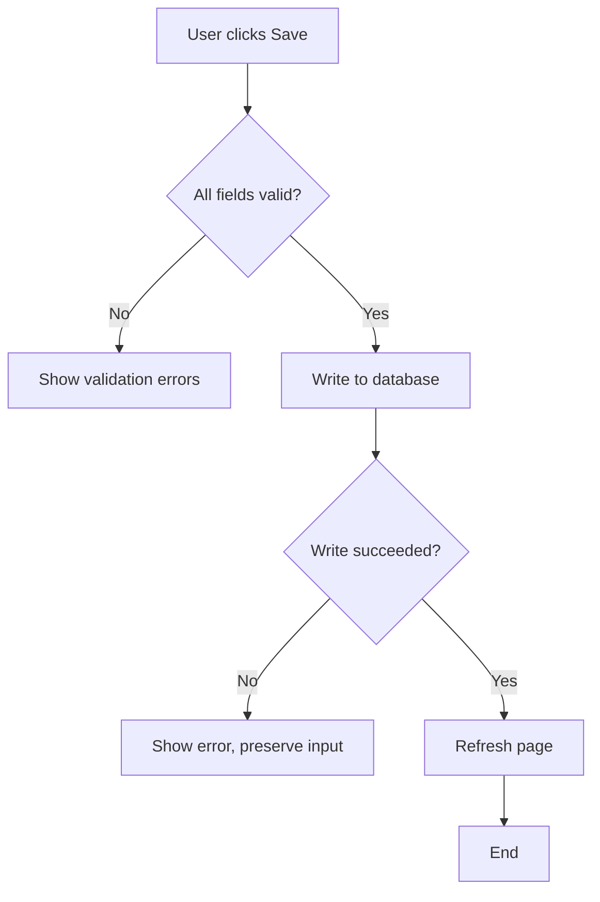
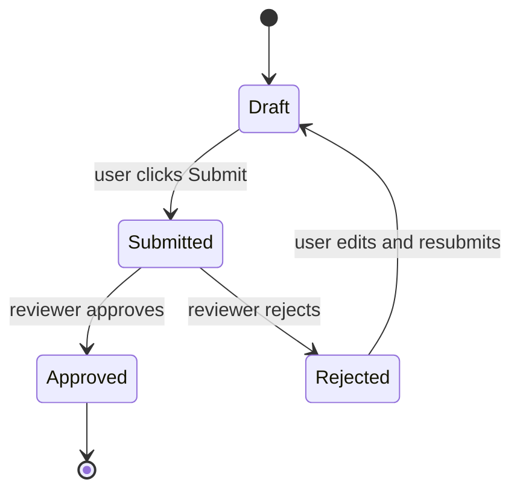
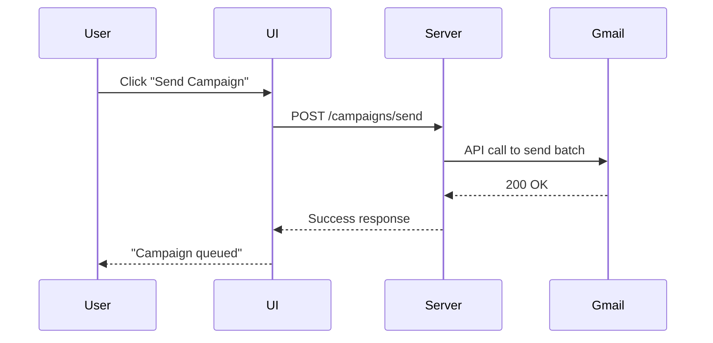
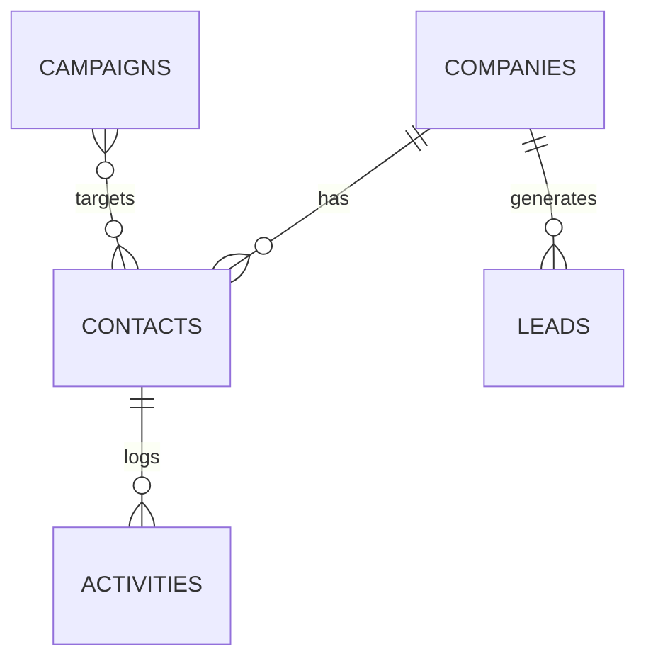

# /flowchart

Compatibility note: flowcharts are no longer a normal main workflow artifact. Use state/transition CSVs in `/write-spec` when behavior must be implemented. Use this command only as an optional diagram helper.

## When to use

Invoke when the user wants a visual representation of:
- A process flow (steps in order) → `graph TD`
- A state machine (system is in state X, event transitions to state Y) → `stateDiagram-v2`
- An interaction between systems or services → `sequenceDiagram`
- An entity relationship (data model) → `erDiagram`

## Pick the right diagram type

Before drawing anything, decide which type fits. This matters — wrong diagram type obscures the thing you're trying to show.

| If the content is... | Use |
|---|---|
| "First A happens, then B, with a branch for error" | `graph TD` (flowchart) |
| "The system is in state X. When Y happens, it moves to state Z" | `stateDiagram-v2` |
| "Service A calls Service B, which calls Service C, which returns to A" | `sequenceDiagram` |
| "Table Companies has many Contacts, which belong to one Lead" | `erDiagram` |
| Genuinely unclear | Ask the user what they want to show most clearly |

## Flowchart — `graph TD`

Top-down flowchart. Best for step-by-step processes with branches.

**Rules:**
- Use rectangles `[X]` for actions, diamonds `{X}` for decisions
- Label branches with `-->|condition|` syntax
- Keep node text short — 3-7 words

## State diagram — `stateDiagram-v2`

Best when the system has distinct states and events transition between them. This matches PLC / event-loop thinking.

**Rules:**
- Every state gets a name (one word or hyphenated)
- Every transition is labeled with the event that causes it
- `[*]` is start/end
- Use `state X { ... }` for nested sub-states if needed

## Sequence diagram — `sequenceDiagram`

Best for multi-system interactions. Shows the order of calls across actors.

**Rules:**
- Declare every participant at the top
- `->>` is a call; `-->>` is a return
- Use `activate` / `deactivate` if lifecycles matter
- Keep messages short

## Entity relationship — `erDiagram`

For data model documentation.

**Rules:**
- Entity names in UPPERCASE
- Cardinality: `||--o{` is one-to-many, `}o--o{` is many-to-many
- Label every relationship with the verb

## General rules for all diagrams

1. **Diagrams go in the spec file they belong to.** Event flows inside the event spec. Page state diagrams inside the page spec. Don't make standalone `.mmd` files unless the diagram is shared across multiple specs.
2. **Keep diagrams small.** If a single diagram has >15 nodes, split it. Complexity in diagrams defeats the purpose.
3. **Test by rendering.** If the diagram is for user review, verify it renders. Broken Mermaid syntax is not a valid deliverable.
4. **Words matter.** A well-named node is worth ten comments. "Validate email format" is useful. "Step 3" is not.

## What you do NOT do in this skill

- Do not draw ASCII flowcharts — always Mermaid
- Do not invent steps you're not sure about — ask the user
- Do not produce a diagram for trivial flows (if it's 2 steps, describe in prose)
